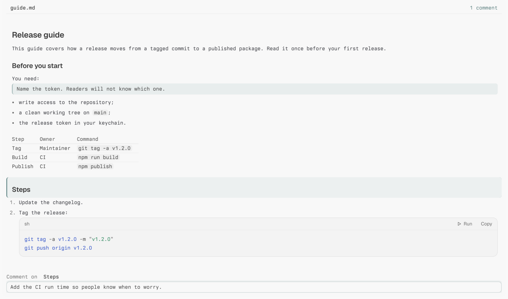

# Margin

[](https://github.com/Noctivoro/tern-margin/actions/workflows/test.yml)

Margin is a Markdown review tool for [Tern](https://stencil.so/tern). Open a Markdown file and Margin renders it block by block. Comment on any paragraph, list item, heading, table or code block, and the comment is saved in the file as [CriticMarkup](https://github.com/CriticMarkup/CriticMarkup-toolkit) (`{>>comment<<}`). Git, editors and agents can all read it, and nothing else in the file changes.

Margin was built for reviewing plans and drafts with coding agents. An agent runs `margin open plan.md`, you review in Tern, and the agent gets your comments back when you press `D`.



The review screen is a [Tern Surface Protocol](https://docs.stencil.so/tern/protocol/) program: it runs in a pane like any command, and Tern draws it natively. So it works the same in a desktop window, the iOS app and the web client, with nothing to install on the client.

Tested with Tern 0.6.1. MIT licensed.

## Install

Margin needs Node 22 or later on the machine that holds your files.

```sh
npm install -g github:Noctivoro/tern-margin
```

That puts the `margin` command on your PATH. Optionally, add the palette command **Review this Markdown file** (it starts a review beside the focused Markdown file block):

```sh
tern plugin install github.com/Noctivoro/tern-margin
```

## Review a file

```sh
margin review notes.md
```

| Key | Action |
| --- | --- |
| `k` or `↓` / `j` or `↑`, click | Next block / previous block, or select by clicking |
| `g` / `G` | First or last block |
| `c`, `enter`, double-click | Comment on the selected block |
| `tab` / `shift+tab` | Next or previous comment |
| `e`, double-click a comment | Edit the selected comment |
| `x` | Delete the selected comment (`y` confirms) |
| `D` | Done: close and report that you finished |
| `q` | Close without finishing |
| `t` | Open the file as text in a Tern file block |
| `r` | Reload from disk |
| `?` | Show more keys |

In the comment box, `enter` saves, `shift+enter` adds a line and `esc` cancels. With Tern's native composer editing on (Settings › Terminal), the comment box behaves like any text field: selection, `⌘⌫`, `⌘Z`. Without it, `⌃U`, `⌃K` and `⌃W` delete to line start, to line end and a word back, and `⌘Z` undoes.

On macOS, holding a letter key shows the accent menu instead of repeating, so holding `k` or `j` moves only once. To make held keys repeat in Tern (as most terminals do), turn off press-and-hold for Tern only, then quit and reopen Tern:

```sh
defaults write so.stencil.tern ApplePressAndHoldEnabled -bool false
```

`defaults delete so.stencil.tern ApplePressAndHoldEnabled` undoes it.

## For agents and scripts

```sh
margin open docs/plan.md --json    # review in a new pane beside this one; waits for the result
margin doctor docs/page.md --json  # exit 1 when CriticMarkup remains
```

`margin open` splits the current pane, runs `margin review` in the new pane, and waits for it to exit. It prints:

```json
{ "status": "done", "path": "…/plan.md", "comments": 3, "comments_before": 0,
  "changed": true, "pre_review_path": "…", "diff_path": "…" }
```

| `status` | Exit | Meaning |
| --- | --- | --- |
| `done` | 0 | The reviewer pressed `D` |
| `abandoned` | 3 | The reviewer pressed `q` |
| `closed` | 3 | The pane closed without the reviewer finishing |

A script can also run `margin review` directly. It exits 0 on `D`, 3 on `q` (or Ctrl+C), 4 if Tern discards its screen, and 5 outside Tern. `margin doctor` counts CriticMarkup outside fenced code and inline code; use it as a gate before publishing a reviewed file.

## Phones, the web client and other machines

`margin open` and `margin review` run on the machine that holds the file, in an ordinary pane. Tern's session daemon starts them, so it doesn't matter which client has focus. Every client attached to that session (desktop, iOS, web) draws the review and sends it keys and clicks. Install Margin on the machine where your files live; clients need nothing.

## How comments are stored

| Block | Where the comment goes |
| --- | --- |
| Paragraph, list item, heading, quote | Appended to the line the block's text ends on: `…text.{>>comment<<}` |
| Table, code block, HTML, front matter | A new paragraph after the block: `{>>comment<<}` |

Margin edits only the comment's own characters. Adding and then deleting a comment restores the file exactly; the tests check this against every block of every fixture, including CRLF files and emoji. One exception: a comment after a table or code block that runs straight into the next line gets a blank line after it, and if the file changes on disk or you reopen the review before you delete that comment, the blank line stays. Comments inside fenced code and inline code spans are text, not comments. A `{>>` with no `<<}` before the next blank line is plain text.

The file is written in place, so symlinks and file modes survive. Before every write Margin re-reads the file. If something else changed it, Margin reloads the file and keeps your unsaved comment in the box. While a review is open, Margin also checks the file for changes once a second.

## Limits

- Margin creates comments only. It shows highlights (`{==…==}`) unwrapped, and shows insertions, deletions and substitutions as raw text.
- Comments attach to whole blocks, not word ranges.
- Files over 4 MiB are not opened.

## Develop

```sh
npm install
npm test     # node:test: parser, comment edits, editor, review state machine, CLI helpers
```

To see the screen while you work, run `node bin/margin.mjs review some.md` in a Tern pane. To drive it from a script, run a second Tern with its own config and daemon and use `tern ctl`:

```sh
D=/tmp/margin-dev; mkdir -p $D
(cd $D && TERN_CONFIG_DIR=$D TERN_DAEMON_SOCKET=$D/daemon.sock tern --control $D/ctl.sock $D) &
C="tern ctl --control $D/ctl.sock"
$C run "\"node $PWD/bin/margin.mjs review some.md\""
$C plugins expect '"Some heading"'
$C key c; $C type '"a note"'; $C key Enter
$C shot review    # PNG under $D/target/shots/tern/live/
```

| Path | What |
| --- | --- |
| `bin/margin.mjs` | The `margin` command: `review`, `open`, `doctor` |
| `review/app.mjs` | The review screen: state, view, keys, file writes |
| `review/blocks.mjs` | Markdown to top-level blocks with source line ranges |
| `review/critic.mjs` | CriticMarkup comment helpers |
| `review/model.mjs` | Blocks plus comments, and the edits that add, change and remove comments |
| `review/editor.mjs` | The comment box's text editing |
| `cli/core.mjs` | `margin doctor`'s CriticMarkup counter |
| `plugin.toml`, `window.luau` | The optional palette command |

## Also by me

[Chirp](https://github.com/Noctivoro/tern-chirp) gives Tern a small robot voice that beeps when an agent finishes or needs you. Jev picks the mood, so you can hear how the turn went.

---

Made by [Nicholas DiMoro](https://nickdimoro.com).
